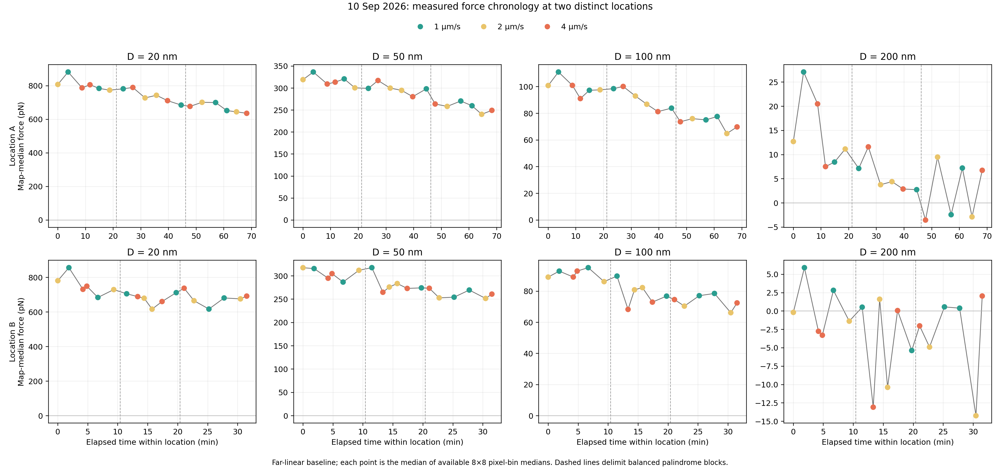
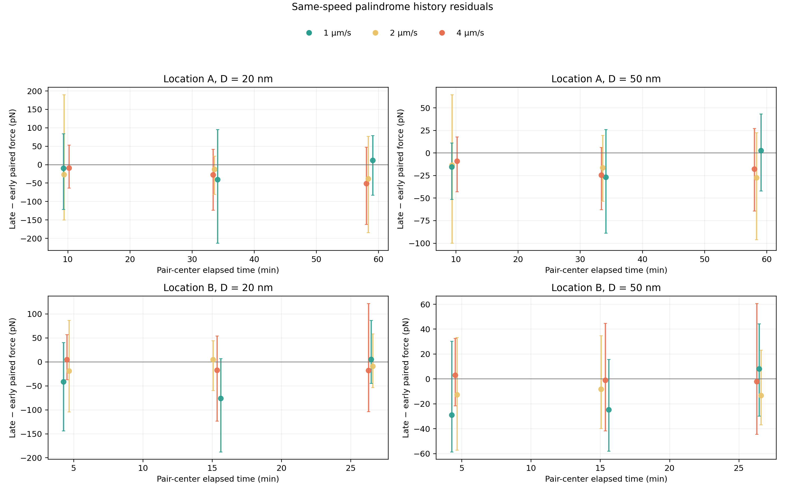
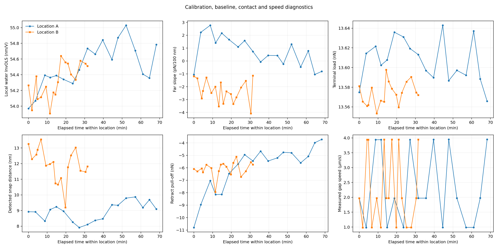
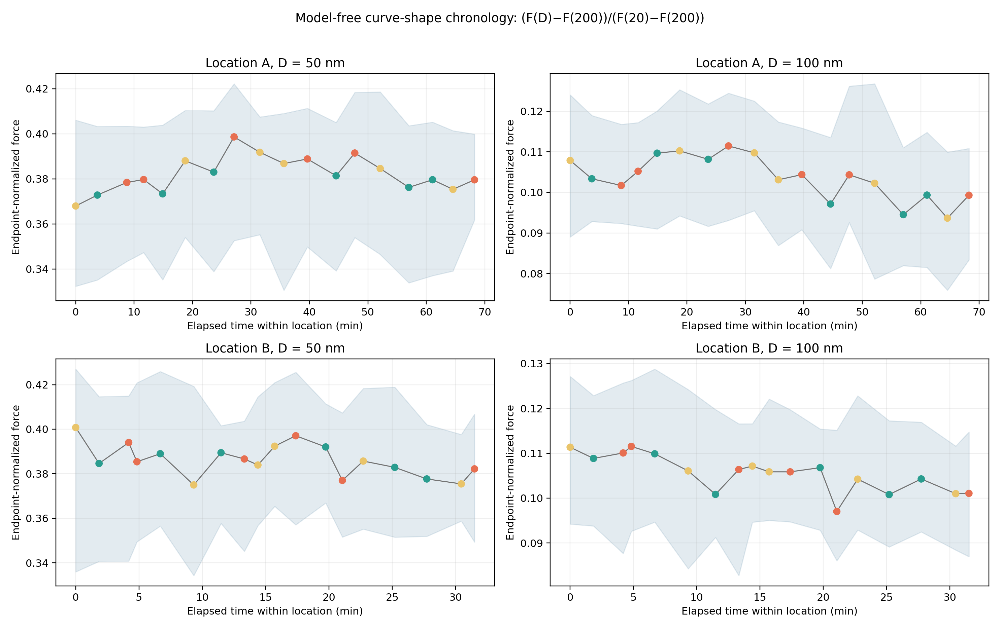

# 10-09-26 pure-water AFM: two-location time/history analysis

## Direct result

The primary dataset consists of two separate 18-map balanced palindrome series. Time/history is estimated within each fixed scanner grid; the intervening survey/reposition maps are not treated as a continuation of the same physical pixels.

All primary forces use the independently air-calibrated D4 spring constant `k=0.164828779 N/m` (repeatability SD `0.017282826 N/m`) and the current-map hard-contact consensus `InvOLS=54.415558 nm/V`. The uniform embedded `k=0.177133126 N/m` and embedded `InvOLS=71.005063 nm/V` are recorded but not used.

| Location | span / min | D / nm | linear time+speed full-span change / pN | HC3 95% CI / pN | HAC(2) 95% CI / pN | 9 palindrome pair medians below zero | median late−early / pN |
|---|---:|---:|---:|:---|:---|---:|---:|
| A | 68.25 | 20 | -200.12 | [-249.26, -150.99] | [-225.08, -175.17] | 8/9 | -26.78 |
| A | 68.25 | 50 | -81.36 | [-99.04, -63.67] | [-92.87, -69.84] | 8/9 | -16.33 |
| A | 68.25 | 100 | -38.06 | [-47.38, -28.75] | [-43.49, -32.63] | 8/9 | -10.00 |
| A | 68.25 | 200 | -16.76 | [-30.70, -2.81] | [-27.01, -6.51] | 7/9 | -7.14 |
| B | 31.50 | 20 | -113.55 | [-214.19, -12.92] | [-205.24, -21.87] | 6/9 | -16.99 |
| B | 31.50 | 50 | -62.57 | [-83.08, -42.06] | [-77.51, -47.62] | 7/9 | -8.28 |
| B | 31.50 | 100 | -23.93 | [-34.23, -13.63] | [-31.99, -15.87] | 6/9 | -4.51 |
| B | 31.50 | 200 | -4.79 | [-17.06, +7.48] | [-10.15, +0.56] | 6/9 | -2.11 |

The regression is a chronological association adjusted for measured gap speed, not a kinetic-law or causal speed estimate. Palindrome late−early differences are same-speed contrasts, but pairs within a location share one evolving experimental history.

### Per-pixel snap-safe sensitivity

The table below removes a pixel at a target distance unless the full 5 nm bin begins at least 5 nm beyond its detected snap-in. This is a conservative sensitivity, not a replacement for the repository's pre-hard-contact binning.

| Location | D / nm | snap-safe full-span change / pN | HC3 95% CI / pN | HAC(2) 95% CI / pN | safe pixels/map | negative palindrome pairs | snap-safe pair median / pN |
|---|---:|---:|:---|:---|:---|---:|---:|
| A | 20 | -200.98 | [-253.03, -148.93] | [-229.97, -171.99] | 58–64 | 8/9 | -26.78 |
| A | 50 | -80.74 | [-99.26, -62.23] | [-92.97, -68.51] | 63–64 | 8/9 | -16.33 |
| A | 100 | -37.87 | [-47.42, -28.33] | [-43.41, -32.33] | 63–64 | 8/9 | -10.00 |
| A | 200 | -16.76 | [-30.70, -2.81] | [-27.01, -6.51] | 64–64 | 7/9 | -7.14 |
| B | 20 | -103.19 | [-164.82, -41.57] | [-160.27, -46.12] | 37–55 | 7/9 | -5.58 |
| B | 50 | -62.57 | [-83.08, -42.06] | [-77.51, -47.62] | 44–64 | 7/9 | -8.28 |
| B | 100 | -23.93 | [-34.23, -13.63] | [-31.99, -15.87] | 44–64 | 6/9 | -4.51 |
| B | 200 | -4.79 | [-17.06, +7.48] | [-10.15, +0.56] | 44–64 | 6/9 | -2.11 |

The 20 nm decrease remains under this guard. Location B's snap-safe 20 nm magnitude is smaller, so the unguarded value should not be interpreted as an all-pixel noncontact force. The 200 nm conclusion remains baseline-limited rather than snap-limited.
The far-constant baseline branch retains negative HC3 intervals at A:20–100 nm and B:50–100 nm. A:200 nm and B:20 nm are therefore not promoted to baseline-robust effects; B:200 nm is inconclusive in both branches.

## Experimental structure

- Location A: instrument scans 5–22, fixed 8×8 grid, 2×2 µm, center (-0.967317, 3.962016) µm.
- Scans 23–24 change field and center and are retained only as survey/reposition records.
- Location B: instrument scans 25–42, fixed 8×8 grid, 2×2 µm, center (-3.176984, 3.524092) µm.
- Each location uses [2,1,4,4,1,2], [1,4,2,2,4,1], [4,2,1,1,2,4] µm/s. Each speed is early/late paired once per block and occupies every palindrome depth once.
- Location B scan 36 stopped after point indices 0–43: 44/64 approach/retract pairs are present and points 44–63 are explicitly missing. No values are imputed; all affected medians and pairs use their recorded finite-pixel count.
- Commanded coordinates repeat exactly within each location, but sample drift is not independently measured. Locations A and B are not same-pixel replicates.

## Reconstruction and calibration

Each approach branch is independently corrected by a robust line fitted to its initial max(80,20%) samples. Hard contact uses a contiguous terminal 50 nm window. Separation and force are

`D = h + InvOLS * V_corrected - h_contact`,  `F = k * InvOLS * V_corrected`.

Absolute pN values and their regression intervals condition on the fixed k and InvOLS. The supplied k repeatability SD is not propagated into those intervals; it scales absolute force, while a common multiplicative scale cancels from endpoint normalization.

Only raw samples preceding the terminal hard-contact fit window are binned in 5 nm intervals; empty bins remain missing. The separate snap-safe sensitivity removes bins too close to a detected jump-to-contact. A far-constant branch is preserved. The global hard-contact consensus uses map-level validity and MAD filtering, with 40/60 nm alternatives of `54.334835/54.565248 nm/V`.

## Same-speed full-interval contrasts

Each row compares the earliest and latest map acquired at the same nominal speed within one location. Pixels are paired by commanded grid coordinate; row-cluster intervals retain the eight physical rows as clusters.

| Location | speed / µm/s | D / nm | elapsed / min | median paired change / pN | row-cluster 95% CI / pN | row sign-flip p |
|---|---:|---:|---:|---:|:---|---:|
| A | 1 | 20 | 57.36 | -149.00 | [-293.15, -22.18] | 0.039062 |
| A | 1 | 50 | 57.36 | -69.88 | [-108.04, -37.08] | 0.0078125 |
| A | 1 | 100 | 57.36 | -35.12 | [-53.60, -20.44] | 0.0078125 |
| A | 1 | 200 | 57.36 | -19.17 | [-27.23, -6.86] | 0.023438 |
| A | 2 | 20 | 64.57 | -77.27 | [-296.92, +23.76] | 0.1875 |
| A | 2 | 50 | 64.57 | -42.34 | [-133.53, -6.39] | 0.17188 |
| A | 2 | 100 | 64.57 | -33.41 | [-63.13, +3.97] | 0.5 |
| A | 2 | 200 | 64.57 | -13.99 | [-35.11, +3.72] | 0.67188 |
| A | 4 | 20 | 59.51 | -137.35 | [-367.13, +15.30] | 0.09375 |
| A | 4 | 50 | 59.51 | -67.36 | [-131.04, -19.17] | 0.023438 |
| A | 4 | 100 | 59.51 | -27.65 | [-50.58, -4.50] | 0.03125 |
| A | 4 | 200 | 59.51 | -10.05 | [-22.76, +3.47] | 0.10156 |
| B | 1 | 20 | 25.89 | -128.24 | [-167.07, -26.76] | 0.17188 |
| B | 1 | 50 | 25.89 | -41.85 | [-62.18, -11.21] | 0.070312 |
| B | 1 | 100 | 25.89 | -22.27 | [-37.54, +7.32] | 0.5 |
| B | 1 | 200 | 25.89 | -3.86 | [-15.01, +3.33] | 0.80469 |
| B | 2 | 20 | 30.45 | -71.80 | [-151.58, +7.13] | 0.10938 |
| B | 2 | 50 | 30.45 | -59.15 | [-78.55, -17.60] | 0.015625 |
| B | 2 | 100 | 30.45 | -32.02 | [-33.87, -18.47] | 0.0078125 |
| B | 2 | 200 | 30.45 | -12.14 | [-15.16, -5.54] | 0.015625 |
| B | 4 | 20 | 27.31 | -48.89 | [-101.25, +31.65] | 0.61719 |
| B | 4 | 50 | 27.31 | -22.61 | [-60.70, +11.24] | 0.24219 |
| B | 4 | 100 | 27.31 | -2.93 | [-26.34, +15.41] | 0.45312 |
| B | 4 | 200 | 27.31 | +8.38 | [-10.64, +20.50] | 0.57812 |

## Model-free curve shape and baseline coupling

Endpoint normalization is `(F(D)-F(200))/(F(20)-F(200))`. A pixel is retained only when `F(20)-F(200) > max(3*far-noise, 50 pN)`. This removes constant offsets and separates curve-shape evolution from a uniform force scale, but it is not a Debye-length estimator.

| Location | D / nm | full-span normalized change | HC3 95% CI | HAC(2) 95% CI | HC3 p | HAC(2) p | residual lag-1 r |
|---|---:|---:|:---|:---|---:|---:|---:|
| A | 50 | +0.00476 | [-0.01002, +0.01954] | [-0.01184, +0.02136] | 0.503 | 0.5504 | +0.702 |
| A | 100 | -0.01121 | [-0.01858, -0.00384] | [-0.01919, -0.00323] | 0.005486 | 0.009056 | +0.417 |
| B | 50 | -0.01196 | [-0.02317, -0.00074] | [-0.02011, -0.00380] | 0.03828 | 0.006966 | -0.081 |
| B | 100 | -0.01019 | [-0.01388, -0.00649] | [-0.01326, -0.00711] | 3.034e-05 | 3.863e-06 | -0.138 |

The same endpoint-normalized model after requiring the 20 nm denominator bin to pass the per-pixel snap guard is:

| Location | D / nm | snap-safe normalized change | HC3 95% CI | HAC(2) 95% CI | safe pixels/map |
|---|---:|---:|:---|:---|:---|
| A | 50 | +0.00462 | [-0.01121, +0.02045] | [-0.01144, +0.02069] | 58–64 |
| A | 100 | -0.01076 | [-0.01777, -0.00376] | [-0.01817, -0.00336] | 58–64 |
| B | 50 | -0.01013 | [-0.02089, +0.00063] | [-0.01940, -0.00087] | 37–55 |
| B | 100 | -0.01285 | [-0.01870, -0.00700] | [-0.01717, -0.00854] | 37–55 |

HC3 is the primary heteroskedasticity-robust interval. Newey-West HAC(1/2) rows are finite-lag serial-correlation sensitivities; with only 18 maps they are not a fitted relaxation-noise model.

The planned Spearman comparisons of absolute and normalized 50 nm force against far-field slope are:

| Location | metric | rho | BH q |
|---|---|---:|---:|
| A | absolute_force_50nm | +0.587 | 0.04161 |
| A | endpoint_normalized_force_50nm | +0.084 | 0.7789 |
| B | absolute_force_50nm | +0.358 | 0.2891 |
| B | endpoint_normalized_force_50nm | +0.071 | 0.7789 |

These correlations diagnose baseline coupling; they are not causal corrections.

## Evidence boundary

- The primary claim concerns measured finite-speed force/history and model-free normalized shape. It does not yet assign a unique mechanism.
- Location, surface relaxation, solution/contamination evolution, contact history, baseline drift and optical sensitivity remain possible contributors.
- The two locations are analyzed separately. Agreement in direction is replication of an association, not one continuous relaxation curve.
- Pixel p-values are retained only as naive diagnostics. Physical-row sign flips and row-cluster bootstrap intervals are the conservative spatial summaries; the map/pair remains the experimental unit.
- A separate PB analysis may report apparent/model-conditioned lambda_D and |psi| only after snap-safe fit-window checks.

## Numerical and provenance checks

- Raw archives: `42`; ZIP CRC failures: `0`; primary maps: `36`; approach/retract pairs: `2284`.
- Independent fixed-pixel reconstruction maximum absolute difference: `0.000e+00 pN`.
- Force arrays: `[36, 64, 100]`; finite target-bin fraction: `0.987739`.
- All time/speed designs had full rank; maximum reported condition number: `21.345`.
- All snap-safe sensitivity designs had full rank; the minimum retained per-map count was `37` pixels.
- Existing PB/base model self-check: `{'far_field_synthetic_slope_relative_error': 5.995204332975845e-15, 'far_field_synthetic_subtraction_max_abs_V': 4.163336342344337e-17, 'pb_linear_limit_max_relative_error': 0.0016521456620162134, 'pb_far_asymptote_max_relative_error': 0.0010543386009638223, 'cheng_water_viscosity_mPa_s': 0.8806453437937073, 'cheng_glycerol_viscosity_mPa_s': 860.333956853547}` (used only as a library check here).
- Random seed for row-cluster bootstrap: `20260910`; bootstrap samples follow the repository advanced-analysis setting `20000`.
- `provenance.json` records input hashes, units, code identity, software versions and claim scope; `artifact_manifest.sha256` covers the model-free package and intentionally excludes the separately manifested `apparent_pb/` package.
