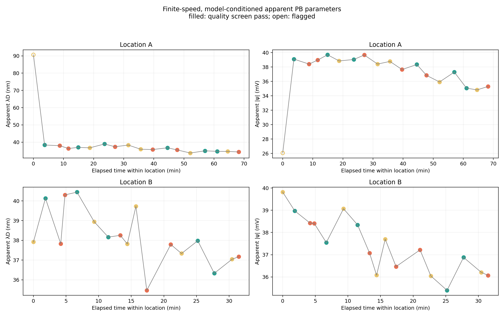
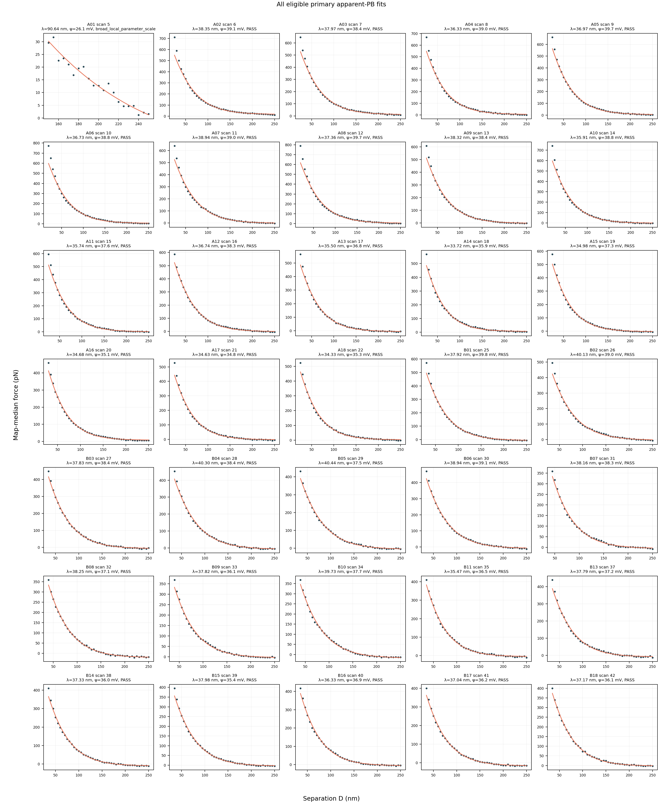

# 10-09-26 secondary apparent-PB analysis

## Direct result and scope

These fits are secondary to the model-free force/history result. They are finite-speed, map-median, equal-constant-potential nonlinear-PB + sphere-plane vdW fits with a fitted constant residual baseline. `lambda_D` and `|psi|` are apparent/model-conditioned; they are not validated bulk Debye length or electrokinetic zeta potential.

PB fitting retained `35/36` primary maps. Scan 36 has only 44 saved pixels and was excluded rather than lowering the established >=48-pixel rule. `34/35` primary fits passed the descriptive quality screen.

## Time-adjusted parameter diagnostics

The model is parameter = intercept + full-location time fraction + measured gap speed. HC3 is the primary map-level interval; Newey-West HAC(1/2) is an ordered-map serial-correlation sensitivity. Quality-pass-only rows are a sensitivity branch and can be selection-biased.

| Location | parameter | subset | n | full-span change | HC3 95% CI | HAC(2) 95% CI | HC3 p | HAC(2) p |
|---|---|---|---:|---:|:---|:---|---:|---:|
| A | lambda_D_apparent_nm | all_eligible_maps | 18 | -19.245 nm | [-53.599, +15.110] | [-45.924, +7.434] | 0.251 | 0.145 |
| A | lambda_D_apparent_nm | quality_pass_maps | 17 | -4.179 nm | [-5.583, -2.775] | [-5.599, -2.759] | 1.703e-05 | 1.916e-05 |
| A | surface_potential_magnitude_apparent_mV | all_eligible_maps | 18 | -0.553 mV | [-9.857, +8.750] | [-8.312, +7.205] | 0.9008 | 0.8812 |
| A | surface_potential_magnitude_apparent_mV | quality_pass_maps | 17 | -4.660 mV | [-6.492, -2.828] | [-6.504, -2.815] | 8.481e-05 | 9.079e-05 |
| B | lambda_D_apparent_nm | all_eligible_maps | 17 | -2.637 nm | [-4.763, -0.512] | [-4.257, -1.018] | 0.01861 | 0.003587 |
| B | lambda_D_apparent_nm | quality_pass_maps | 17 | -2.637 nm | [-4.763, -0.512] | [-4.257, -1.018] | 0.01861 | 0.003587 |
| B | surface_potential_magnitude_apparent_mV | all_eligible_maps | 17 | -3.352 mV | [-4.609, -2.094] | [-4.425, -2.279] | 5.325e-05 | 1.007e-05 |
| B | surface_potential_magnitude_apparent_mV | quality_pass_maps | 17 | -3.352 mV | [-4.609, -2.094] | [-4.425, -2.279] | 5.325e-05 | 1.007e-05 |

## Per-map primary results

The lower bound is set per map so the lower edge of every fitted bin lies at least 5 nm beyond the largest detected approach snap. A single long-distance event in A01 therefore moves its lower bound to 150 nm; its result must be read from the quality flags, not treated like a near-field fit.

| Location-map | scan | speed / µm/s | time / min | window / nm | apparent λD / nm | apparent |ψ| / mV | R2 | status |
|---|---:|---:|---:|:---|---:|---:|---:|---|
| A01 | 5 | 2 | 0.00 | 150–250 | 90.637 | 26.061 | 0.9539 | broad_local_parameter_scale |
| A02 | 6 | 1 | 3.71 | 25–250 | 38.347 | 39.094 | 0.9685 | PASS |
| A03 | 7 | 4 | 8.75 | 25–250 | 37.967 | 38.399 | 0.9807 | PASS |
| A04 | 8 | 4 | 11.63 | 25–250 | 36.326 | 38.960 | 0.9820 | PASS |
| A05 | 9 | 1 | 14.89 | 25–250 | 36.975 | 39.691 | 0.9889 | PASS |
| A06 | 10 | 2 | 18.74 | 20–250 | 36.727 | 38.840 | 0.9679 | PASS |
| A07 | 11 | 1 | 23.63 | 25–250 | 38.940 | 39.037 | 0.9821 | PASS |
| A08 | 12 | 4 | 27.10 | 20–250 | 37.356 | 39.663 | 0.9723 | PASS |
| A09 | 13 | 2 | 31.52 | 25–250 | 38.324 | 38.403 | 0.9863 | PASS |
| A10 | 14 | 2 | 35.63 | 20–250 | 35.906 | 38.769 | 0.9796 | PASS |
| A11 | 15 | 4 | 39.65 | 25–250 | 35.737 | 37.642 | 0.9881 | PASS |
| A12 | 16 | 1 | 44.57 | 25–250 | 36.741 | 38.344 | 0.9948 | PASS |
| A13 | 17 | 4 | 47.76 | 25–250 | 35.503 | 36.838 | 0.9899 | PASS |
| A14 | 18 | 2 | 52.11 | 25–250 | 33.722 | 35.919 | 0.9891 | PASS |
| A15 | 19 | 1 | 57.01 | 25–250 | 34.984 | 37.287 | 0.9898 | PASS |
| A16 | 20 | 1 | 61.07 | 30–250 | 34.684 | 35.061 | 0.9941 | PASS |
| A17 | 21 | 2 | 64.57 | 25–250 | 34.632 | 34.819 | 0.9860 | PASS |
| A18 | 22 | 4 | 68.25 | 25–250 | 34.333 | 35.297 | 0.9920 | PASS |
| B01 | 25 | 2 | 0.00 | 30–250 | 37.918 | 39.817 | 0.9904 | PASS |
| B02 | 26 | 1 | 1.84 | 35–250 | 40.131 | 38.974 | 0.9875 | PASS |
| B03 | 27 | 4 | 4.19 | 35–250 | 37.828 | 38.427 | 0.9972 | PASS |
| B04 | 28 | 4 | 4.84 | 35–250 | 40.304 | 38.409 | 0.9945 | PASS |
| B05 | 29 | 1 | 6.68 | 35–250 | 40.443 | 37.546 | 0.9960 | PASS |
| B06 | 30 | 2 | 9.32 | 35–250 | 38.940 | 39.070 | 0.9948 | PASS |
| B07 | 31 | 1 | 11.48 | 45–250 | 38.164 | 38.343 | 0.9959 | PASS |
| B08 | 32 | 4 | 13.32 | 40–250 | 38.255 | 37.071 | 0.9977 | PASS |
| B09 | 33 | 2 | 14.39 | 40–250 | 37.821 | 36.078 | 0.9946 | PASS |
| B10 | 34 | 2 | 15.72 | 40–250 | 39.725 | 37.697 | 0.9970 | PASS |
| B11 | 35 | 4 | 17.38 | 35–250 | 35.465 | 36.465 | 0.9973 | PASS |
| B13 | 37 | 4 | 21.06 | 35–250 | 37.790 | 37.218 | 0.9930 | PASS |
| B14 | 38 | 2 | 22.71 | 35–250 | 37.333 | 36.045 | 0.9942 | PASS |
| B15 | 39 | 1 | 25.20 | 35–250 | 37.979 | 35.395 | 0.9952 | PASS |
| B16 | 40 | 1 | 27.73 | 35–250 | 36.329 | 36.880 | 0.9967 | PASS |
| B17 | 41 | 2 | 30.45 | 35–250 | 37.042 | 36.205 | 0.9957 | PASS |
| B18 | 42 | 4 | 31.50 | 35–250 | 37.172 | 36.069 | 0.9979 | PASS |

## Method sensitivity

Variant changes are paired to each map's primary optimum; quartiles across maps are descriptive, not confidence intervals.

| Location | variant | maps | pass | median lambda change | median potential change |
|---|---|---:|---:|---:|---:|
| A | constant_baseline | 18 | 17 | +4.57% | -2.28% |
| A | lower_plus_10nm | 18 | 17 | +3.63% | -1.68% |
| A | upper_200nm | 17 | 17 | -3.76% | -0.07% |
| A | common_150_250nm | 18 | 0 | +5.91% | +2.92% |
| A | no_slip_hydrodynamic | 18 | 17 | -0.56% | -1.86% |
| B | constant_baseline | 17 | 17 | +6.06% | -1.47% |
| B | lower_plus_10nm | 17 | 17 | +2.97% | -1.35% |
| B | upper_200nm | 17 | 17 | -2.14% | +0.01% |
| B | common_150_250nm | 17 | 0 | -4.16% | +7.44% |
| B | no_slip_hydrodynamic | 17 | 17 | -0.74% | -1.92% |

The shared 150–250 nm tail produced `0/35` quality-pass fits; it does not independently identify the PB parameters.

## Model and evidence boundary

- Fixed inputs: R=4.546849 µm, T=25.6 °C, water epsilon_r=78.5, A_H=2.4e-21 J; force reconstruction uses D4 k=0.164828779 N/m and the upstream current-water InvOLS.
- Reported parameter trends condition on fixed k, InvOLS, R, temperature, dielectric constant, Hamaker constant and boundary condition; these systematic uncertainties are not included in HC3/HAC intervals.
- The surface model assumes symmetric 1:1 electrolyte, equal constant potential, Derjaguin geometry and a constant residual baseline. The force fit determines potential magnitude only.
- `no_slip_hydrodynamic` subtracts a fixed ideal 6*pi*eta*R^2*U/D sensitivity after applying the same per-curve far-line projection. It does not identify slip or hydrodynamic amplitude from the data.
- The 150–250 nm common-window branch tests whether a shared tail supports the parameters. High R2 alone does not override boundary, Jacobian, weak-signal or local-scale flags.
- Adjacent distance bins and pixels are correlated. Local parameter scales are conditioning diagnostics relative to spatial MAD, not experimental confidence intervals.
- Any parameter chronology must agree with the primary measured-force and normalized-shape evidence and remains unable to distinguish surface relaxation, solution evolution, contact history and instrumental effects uniquely.

## Numerical checks

- Optimizer success: `209/209`; finite parameter rows: `209/209`.
- Maximum prediction re-evaluation difference: `0.000e+00 pN`.
- Maximum relative two-start cost difference among primary fits: `7.234e-03`; minimum snap-guard margin: `0.105 nm`.
- Ideal no-slip check F(2U)/F(U): `2.000000000000`; F(20 nm)/F(50 nm): `2.500000000000`.
- Existing nonlinear-PB/base self-check: `{'far_field_synthetic_slope_relative_error': 5.995204332975845e-15, 'far_field_synthetic_subtraction_max_abs_V': 4.163336342344337e-17, 'pb_linear_limit_max_relative_error': 0.0016521456620162134, 'pb_far_asymptote_max_relative_error': 0.0010543386009638223, 'cheng_water_viscosity_mPa_s': 0.8806453437937073, 'cheng_glycerol_viscosity_mPa_s': 860.333956853547}`.
- `provenance.json` binds upstream artifacts, raw identities, code and software; `artifact_manifest.sha256` covers this directory.
