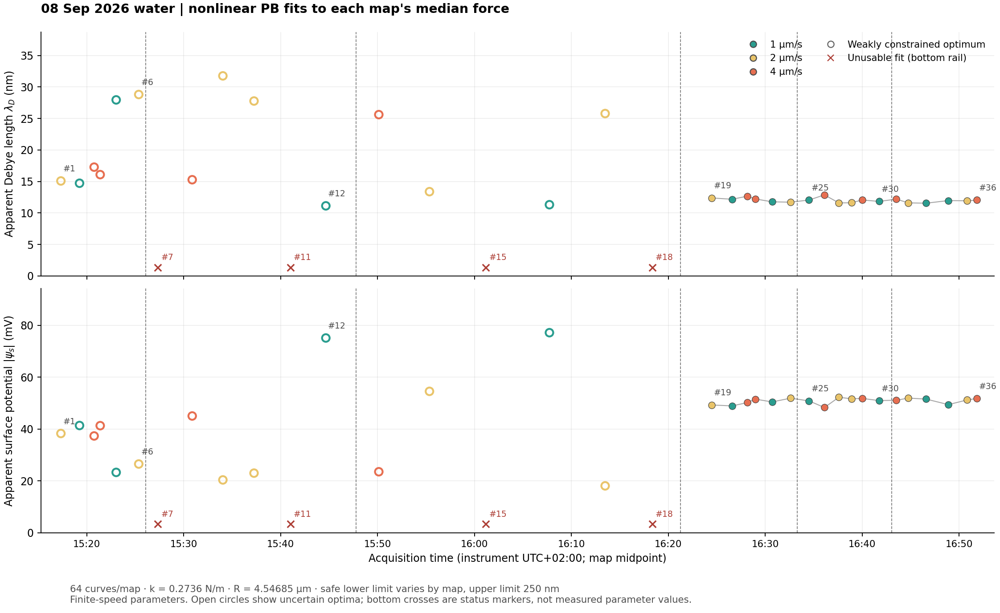
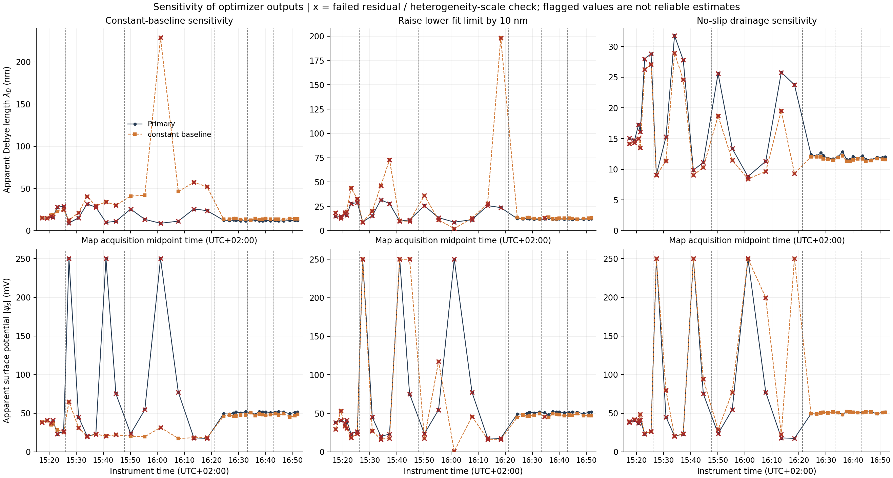
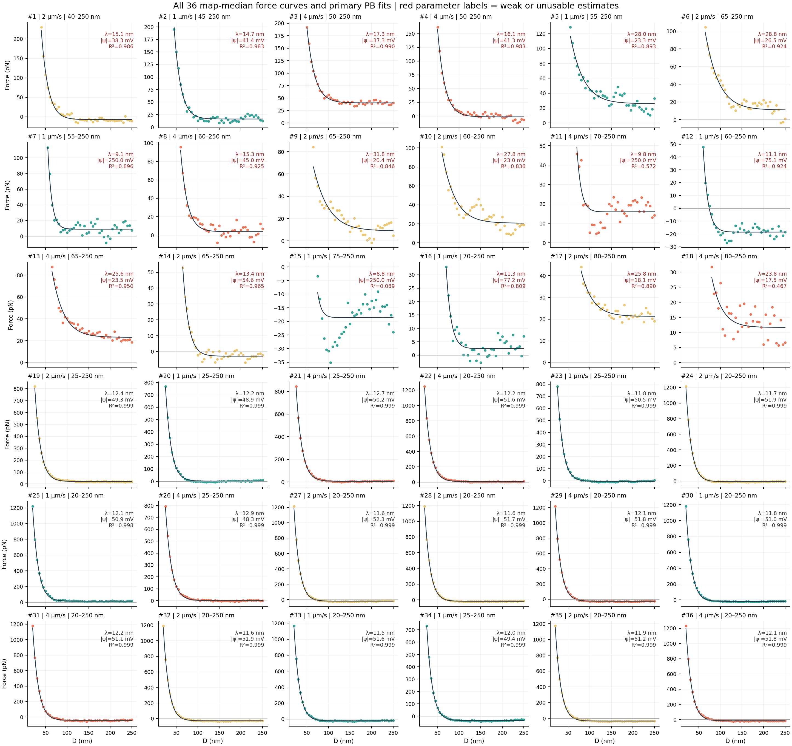

# 08-09-26 水中 Debye length 与 surface potential 拟合

本次计算复用 `analysis/fit_glycerol_surface_forces.py` 的非线性 PB 球—平板力模型。每个点对应一张 map 的中位力曲线拟合；不是 64 个逐曲线拟合参数的中位数。横轴是实际 map 起止时间的中点（仪器 UTC+02:00）。

## 结果

36 张 map 均完成拟合；18/36 通过残差和相对于像素异质性尺度的参数约束检查，即第 19–36 张。筛查通过不等同于验证平衡电双层模型。

| Map 范围 | 表观 λ_D 中位数 [最小, 最大] / nm | 表观 ψ_s 幅值中位数 [最小, 最大] / mV |
|---|---:|---:|
| 19–36 | 12.01 [11.55, 12.87] | 51.18 [48.32, 52.27] |

第 1–18 张的最优拟合参数保留在 CSV，但都未通过上述约束检查。主图空心点表示参数约束较弱的最优值；第 7、11、15、18 张因参数触边、残差或弱信号问题，仅在底部标红叉。红叉是状态标记，不是零值，也不是原始数据缺失。第 7、11、15 张达到约 250 mV 的优化上界，不能解释成真实电势达到了 250 mV。

第 1–18 张起始距离为 40–80 nm，第 19–36 张为 20–25 nm，两段可用距离范围不同。统一为 80–250 nm 后，36 张均未通过像素异质性尺度下的参数约束检查。因此不能依据主图断言第 18→19 处 Debye length 或表面电势发生了可定量确认的跳变。上述表中范围是 map 间范围，不是置信区间。

## 输入、模型与拟合窗口

- 输入：已按 cantilever2 的 `k=0.2736 ± 0.0063 N/m` 及水中全局 InvOLS 重建的 36×64 条 approach 曲线。逐曲线取 5 nm 距离箱中位数，再在每张 map 内取像素中位数。保留缺测；拟合箱要求至少 48 个像素。与上游中位数 CSV 的逐箱数值及像素数已核对。
- 几何与介质：`R=4.54685 µm` 为用户本次明确授权沿用，未重新测量；`T=25.6 °C` 沿用仓库模型，非本批元数据实测温度；水 `ε_r=78.5`，`A_H=2.4×10⁻²¹ J`。
- 模型：对称 1:1 电解质、球与平面具有相同恒定表面电势；`F(D)=F_PB(D; λ_D, |ψ_s|)−A_H R/(6D²)+B`。B 为各 map 的常数残余基线。力模型只识别电势幅值；未赋予负号，也未将它视为电动学 ζ 电势测量。
- 主拟合窗口上限 250 nm。下限为 `max(20, 5 ceil((max_detected_snap_nm+7.5)/5)) nm`：每个所用距离箱下边缘比该 map 最大已检测跳入距离至少高 5 nm。下限依 map 改变，避免混入机械跳跃；它并不证明其他自由支上的力完全满足 PB。
- 优化沿用原脚本的 log(λ_D)、log(|ψ_s|)、B 参数化、两组初值、soft_l1 损失及边界：λ_D=1–1000 nm，|ψ_s|=0.1–250 mV，B=−500–500 pN。本适配脚本按实际优化的 soft_l1 cost 选择初值结果。未伪造 `speed_groups=3`，未调用原脚本要求三速度截距输入的 `fit_equilibrium()`。
- 权重尺度采用像素力的 `1.4826×MAD`，底限为 `max(3 pN, 400–500 nm 中位力曲线的 robust MAD)`。由于已保存距离到 500 nm，底限参考窗不同于原脚本的 500–850 nm。没有将 64 个空间相关像素当作 64 次独立实验，也没有除以 √64。

## 解释边界与敏感性

这些是每张 map 在 1/2/4 µm/s 有限接近速度下、所选力模型和基线条件下的表观参数。未把随时间变化的各 map 合并为平衡力，也未做三速度零速外推。

保存了五种敏感性结果：相同距离坐标的常数远场基线；下限增加 10 nm；上限降至 200 nm；所有 map 共用 80–250 nm；扣除 `6πηR²U/D` 的 no-slip drainage（U 取逐曲线实测 gap speed，η 沿用水的 Cheng correlation）；理论阻力先在各曲线原始远场采样点按 scanner height 拟合并扣除线性部分，再从逐像素力中扣除，最后取中位数。该远场投影近似匹配实验基线算子；没有假定 median(F−Fhyd)=median(F)−median(Fhyd)。最后一种只是固定物理模型的敏感性，不证明无滑移或阻力修正正确。

`fit_quality_pass` 检查优化结束、参数边界、局部 Jacobian、R²≥0.70、信号≥5×底噪及局部 log 参数尺度≤0.5。局部尺度从按像素 MAD 加权的 Jacobian 得到，不因中位曲线残差小就将尺度缩小；协方差诊断因子为 `max(加权残差平方和/(箱数−3), 1)`。该阈值是一项保守的描述性筛查。CSV 的局部尺度不是实验置信区间；未将距离箱当作独立实验，也未包含 InvOLS、k、距离零点、球半径及表面边界条件的全部系统误差。

no-slip 比较的 U 是已有 20–200 nm gap-speed 回归的代理量；早期该区间包含跳跃运动，因此它只用于近似敏感性，不用于验证黏性阻力机制。

### 第 19–36 张的敏感性摘要

下表中位数使用这 18 张的最优值；检查通过列单独给出通过数量。变体间差异不是置信区间。

| 方案 | λ_D 中位数 / nm | 电势幅值中位数 / mV | 检查通过 |
|---|---:|---:|---:|
| 主拟合 | 12.01 | 51.18 | 18/18 |
| 常数远场基线 | 13.69 | 47.72 | 18/18 |
| 起始距离增加 10 nm | 12.78 | 47.22 | 17/18 |
| 终止距离降至 200 nm | 12.04 | 51.16 | 18/18 |
| 近似 no-slip 修正 | 11.67 | 50.89 | 18/18 |
| 共用 80–250 nm | 不可可靠确定 | 不可可靠确定 | 0/18 |

起始距离增加 10 nm 的变体中，第 25 张未通过异质性尺度检查；主拟合并未出现单像素图中那样的离群参数。

## 文件

- [DATA_QUALITY_COMPARISON.md](DATA_QUALITY_COMPARISON.md)：前 18 张与后 18 张的内部及组间质量比较；后组统一 25–250 nm 的补充诊断保存在 `quality_comparison/`，与本报告的原主拟合分开。
- `fit_parameters_per_map.csv`：主结果，36 行。
- `fit_parameters_all_variants.csv`：全部 216 个拟合及诊断。
- `map_median_fit_inputs.csv`：逐距离箱输入、权重、像素数与安全窗。
- `fitted_force_curves.csv`：各拟合曲线。
- `parameter_sensitivity.csv`：相对主结果变化。
- `provenance.json`、`artifact_manifest.sha256`：来源、代码、环境及校验。

重现：在仓库根目录运行 `python -X utf8 analysis/fit_08_09_26_water.py --workers 4`。
